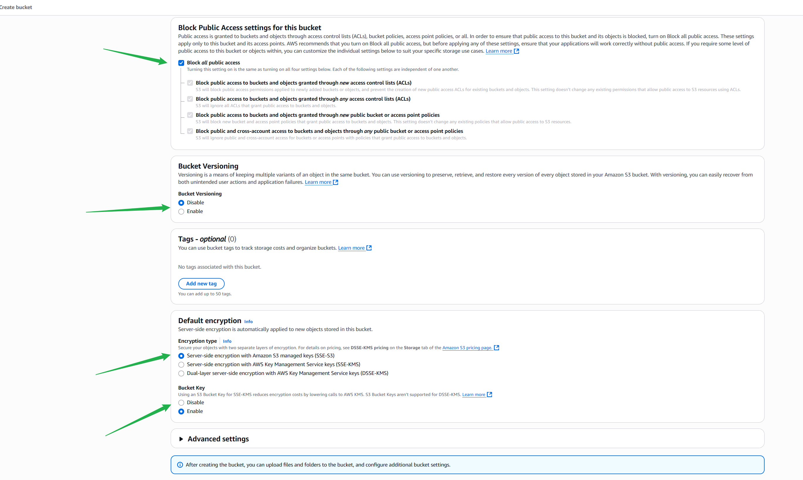

# aws-s3-mini-project
A demo of hands-on practice using the management console to interact with aws
##Login to your aws accounnt and search for 's3'

##Locate and press 'create bucket'

##Enter the unigue name 

select ACL 
Select block all public access
click on 'disable version'

click on disable 'create button'

##On your desktop create a file 

##On aws s3 console click on upload

##add file, and upload

##Now tht the bucket has s been created, click on it

##select the file

##Edit the versioning

##Enable versioning

##add text or modify the file

##upload and check to show versions

##set Allow permission

##uncheck 'Block all public access'

##confirm oyur changes

##now that the block access toall is off click on edit policy

## Now, select the "Type of Policy" as "S3 Bucket
Policy"
a) Set the "Effect" to "Allow",
b) specify the "Principal" as "*" which means all users.
c) Choose the action "Get object " and "Get object
version",
d) In the field of Amazon Resource Name (ARN), type the
ARN of your bucket and add by "/*" after the ARN.
Then,
e) click on "Add statement".

##Copy the statment code and close the page

##PAste the permission you copied to the permissions page and save changes

##click the link

##To create a lifecycle policy click on 'creaate lifecycle policy'

