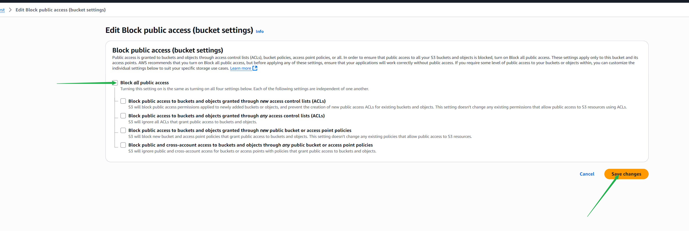

# AWS S3 Mini Project

## Project Overview

**Participants have gained hands-on experience with Amazon S3, a core service of AWS.  
They have managed S3 buckets and objects, learning key concepts like versioning, permissions management, and lifecycle policies.  
Through practical tasks, participants developed a solid understanding of S3 features.  
They learned to optimize storage costs and ensure data reliability and accessibility using AWS features.  
This project equipped participants with valuable skills applicable to real-world scenarios.**

---

## Table of Contents

- [Project Overview](#project-overview)
- [Prerequisites](#prerequisites)
- [Step-by-Step Guide](#step-by-step-guide)
    1. [Log in to AWS & Find S3](#1-log-in-to-aws--find-s3)
    2. [Create an S3 Bucket](#2-create-an-s3-bucket)
    3. [Configure Bucket Settings](#3-configure-bucket-settings)
    4. [Upload Files to S3 Bucket](#4-upload-files-to-s3-bucket)
    5. [Enable and Use Versioning](#5-enable-and-use-versioning)
    6. [Set Bucket Permissions](#6-set-bucket-permissions)
    7. [Apply Bucket Policy](#7-apply-bucket-policy)
    8. [Create Lifecycle Policy](#8-create-lifecycle-policy)
- [Conclusion](#conclusion)

---

## Prerequisites

- AWS Account (sign up at [https://aws.amazon.com/](https://aws.amazon.com/) if you don’t have one)
- Basic familiarity with AWS Management Console

---

## Step-by-Step Guide

### 1. Log in to AWS & Find S3

- Log into your AWS account.
- In the AWS Management Console, search for **S3** in the search bar.

---

### 2. Create an S3 Bucket

- Click **Create bucket**.

- Enter a **unique bucket name**.

---

### 3. Configure Bucket Settings

- Select **ACL** (Access Control List) if needed.
- For security, **block all public access**.
- (Optional) **Disable versioning** if you don’t want multiple versions initially.

- Click **Create bucket**.

---

### 4. Upload Files to S3 Bucket

- On your desktop, create a file to upload.
- In the S3 console, click **Upload**.

- Add the file, then click **Upload**.

---

### 5. Enable and Use Versioning

- Click on your bucket to open it.

- Select the file you uploaded.

- Click **Edit Versioning**.

- Enable **Versioning**.

- Modify your file (e.g., add text) and upload it again to see version history.

---

### 6. Set Bucket Permissions

- Set **Allow** permission for objects as needed.

- Uncheck **Block all public access** to allow public access if desired.

- Confirm your changes.

---

### 7. Apply Bucket Policy

- Click **Edit Policy** to add a custom bucket policy.

#### Example Policy

- Select **Type of Policy** as **S3 Bucket Policy**.
    - Set **Effect** to `Allow`
    - Set **Principal** to `*` (all users)
    - Choose actions: `GetObject` and `GetObjectVersion`
    - Specify the bucket ARN (e.g., `arn:aws:s3:::your-bucket-name/*`)
    - Click **Add statement**

- Copy the statement code and paste it into the permissions page, then save changes.

---

### 8. Create Lifecycle Policy

- To optimize storage costs, create a **Lifecycle Policy** to automatically manage objects.

- Click **Create lifecycle policy**.

---

## Conclusion

By following these steps, you have:
- Created and configured an S3 bucket.
- Uploaded files and enabled versioning.
- Set permissions and applied bucket policies.
- Implemented lifecycle policies for efficient storage management.

You now have hands-on experience with AWS S3 and have learned the best practices for managing storage, permissions, and costs in a real-world environment.

---
